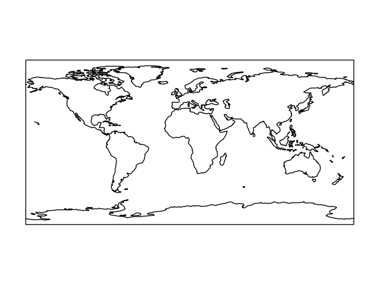
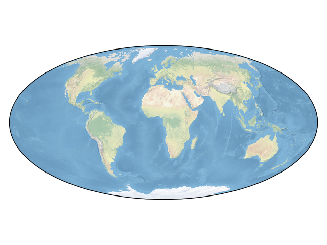
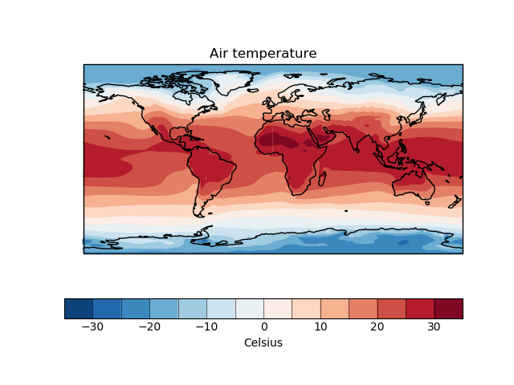

# python-notes
My own notes and snippets, giving some examples about how to do various pythony things. 

In particular, there's a focus on creating maps (using [cartopy](https://scitools.org.uk/cartopy/docs/latest/index.html)) and plotting data in them (using [iris](https://scitools.org.uk/iris/docs/latest/index.html)).

I might add other things about plotting using [matplotlib](https://matplotlib.org/) more generally too.

The mapping demos are:
* [sketch_maps.py](sketch_maps.py):

    , , , , 

* [projections_demo.py](projections_demo.py): 

   

* [quick_data_maps.py](quick_data_maps.py):

    , , , , , 

* [full_iris_plot.py](full_iris_plot.py)

    

